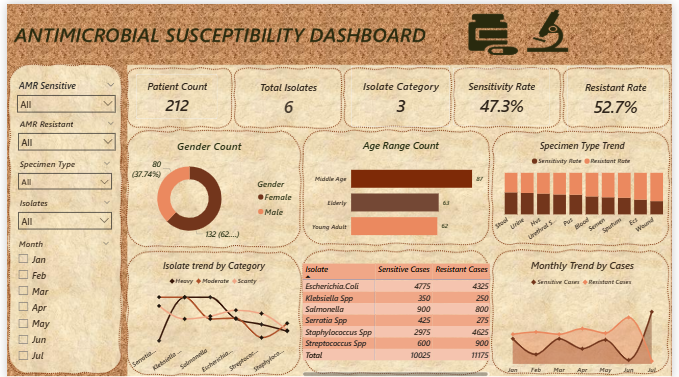

# ANTIMICROBIAL-SUSCEPTIBILITY-ANALYSIS

Interactive Power BI dashboard analyzing antimicrobial susceptibility, resistance patterns, clinical isolates and laboratory trends.

## PROJECT OVERVIEW

This project presents an interactive Antimicrobial Susceptibility Dashboard developed to analyze antimicrobial susceptibility and resistance patterns across clinical isolates. The dashboard provides a data-driven view of 212 patients, 6 bacterial isolates and 3 isolate categories. It evaluates sensitive and resistance cases, overall sensitivity and resistance rates, isolate trends, specimen type and monthly case patterns. The dashboard was designed to help laboratory professional and healthcare stakeholders identify resistance patterns, monitor antimicrobial susceptibility trends and support evidence-based interpretation of microbiological laboratory data and demonstrates how laboratory data can be transformed into meaningful insights.

## PROJECT OBJECTIVE

- Analyze antimicrobial susceptibility patterns by comparing sensitive and resistant cases.
- Calculate key laboratory KPIs including;
  * Patient count
  * Total isolates
  * Isolate categories
  * Sensitivity rates
  * Resistance rates
- Evaluate antimicrobial resistance trends across different isolates.
- Analyze demographic patterns using gender and age-range distributions.
- Analyze specimen-type trends to understand the distribution of clinical specimens.
- Monitor monthly susceptibility and resistance patterns to identify changes over time.
- Compare sensitive and resistant cases across bacterial isolates.
- Transform laboratory data into an interactive dashboard that supports data-driven interpretation and reporting.

  ## DASHBOARD VIEW

 

## KEY RESULTS
- Patient count:                         212
- Total isolates:                        6
- Isolate categories:                    3
- Sensitivity rate:                      47.3%
- Resistance rate:                       52.7%
- Total sensitive cases:                 1,025
- Total resistant cases:                 1,175

## PROJECT SUMMARY

  The dashboard indicates that resistance cases and rate are higher than sensitive cases and rate. The dashboard also provides            insights into differences across bacterial isolates, age range, specimen types and monthly trends. It indicates that there is a 
- High rate of resistance among middle age females.
- The month of  June has the highest resistant cases.
- Staphylococcus is the highest resistant isolate while E. coli is the highest sensistive isolate.
- Urine culture has the highest patient count of 99 and was recorded in every month with July giving the highest sensitivity cases and    February giving highest resistant cases.
- Sputum MCS has 15 patient count mostly male with June having high peak of resistance with 56.3% of scanty growth of Streptococcus.
- Semen MCS has 14 patient count and of course male with high resistance in moderate growth of staphylococcus.
- Urethral MCS has 12 patient count, male with high resistance in moderate growth of staphylococcus.
- ECS and HVS has 12 patient count each with high resistance in scanty growth of E. coli and same high resistance heavy growth in both    heavy and scanty growth of staphylococcus.
- Blood culture has 11 patient count with high peak of resistance in scanty growth of E. Coli and moderate growth staphylococcus.
- Wound MCS 11 patient count with high resistance in moderate and scanty growth of E. Coli and also moderate and scanty.
- PUS culture has 9 patient count with high resistance in scanty growth of E. Coli.

 ## RECOMMENDATION

 - Conduct monthly AMR surveillance to identify emerging resistance patterns early.
 - Analyze resistance by specimen type to identify high-risk infection sources.
 - Develop organism-specific antibiograms to support evidence-based treatment decisions.
 - Investigate persistent high resistance through further laboratory and clinical review.
 - Monitor high resistance organism closely and investigate unusual increases.

 ## TOOLS & SKILLS

  - Microsoft Power BI
  - DAX
  - Data Cleaning
  - Data Transformation
  - Data Visualization
  - Exploratory Data Analysis
  - Dashboard Design 

 ##  AUTHOR

 **FavourChinny**
 Data Analyst / Medical Laboratory Technician / Power BI / SQL / Excel / Data Visualization.
  
